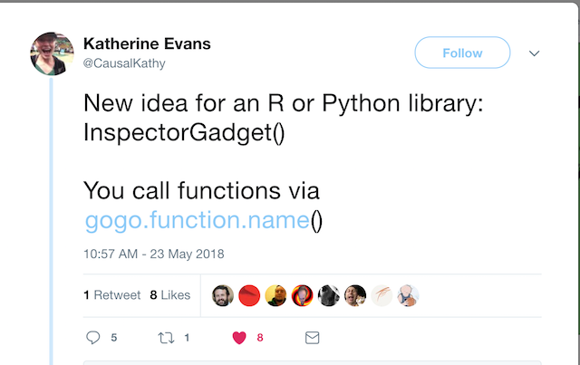

# inspectoRGadget

The goal of inspectoRGadget is to meet an urgent need spelled out in this [twitter plea](https://twitter.com/CausalKathy/status/999091807937028096)



## Installation

You can install the development version of `inspectoRGadget` from [github](https://www.github.com) with:

``` r
# install.packages("devtools")
devtools::install_github("adam-gruer/inspectoRGadget")
 
```

## Example

Step 1: **gadgetize** an installed package by calling `gogo_gadget_arms()`
  Wowsers!  All that package's functions and objects can be used by typing
  `gogo_{function/object}` 
``` r
library(inspectoRGadget)

gogo_gadget_arms("dplyr")
```
  All those gogo_s now live in your r session's global environment.
  That _is probably frowned upon_  , I'd love to learn how to avoid doing that,
  let me know if you already have a solution.

Step 2: **gogo_** all the things!
  here we gogo_filter the `beaver1` dataset to find when the critter was active
``` r
gogo_filter(beaver1, activ ==1)
```
### **Please note there are probably lots of reasons  is not a good idea but neither Brain nor Penny was around to stop us**

## Code of Conduct

Please note that this project is released with a [Contributor Code of Conduct](CODE_OF_CONDUCT.md).
By participating in this project you agree to abide by its terms.


