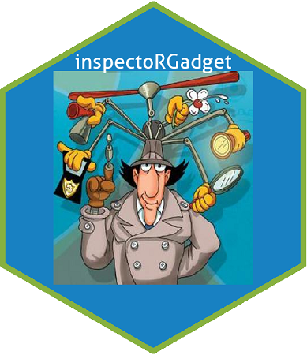

<!-- README.md is generated from README.Rmd. Please edit that file -->
[](https://travis-ci.org/adam-gruer/inspectoRGadget) [](https://ci.appveyor.com/project/adam-gruer/inspectoRGadget) [](https://codecov.io/github/adam-gruer/inspectoRGadget?branch=master)

inspectoRGadget
===============



The goal of inspectoRGadget is to meet an urgent need spelled out in this [twitter plea](https://twitter.com/CausalKathy/status/999091807937028096)


Installation
------------

You can install the development version of `inspectoRGadget` from [github](https://www.github.com) with:

``` r
# install.packages("devtools")
devtools::install_github("adam-gruer/inspectoRGadget")
 
```

Example
-------

Step 1: **gadgetize** your favourite installed package by calling `gogo_gadget_arms()` Wowsers! All that package's functions and objects can now be used by typing `gogo_{function/object}`

``` r
library(inspectoRGadget)

gogo_gadget_arms("dplyr")
```

Step 2: **gogo\_** all the things! Here we `gogo_filter()` the `beaver1` dataset to find when the critter was active

``` r
gogo_filter(beaver1, activ == 1)
#>   day time  temp activ
#> 1 346 1730 37.07     1
#> 2 346 1950 37.10     1
#> 3 346 2150 37.53     1
#> 4 346 2230 37.25     1
#> 5 346 2300 37.24     1
#> 6 347  340 37.15     1
```

All those gogo\_s now live in your search path in an environment called `gadget_arms` (thanks for the [tip Hadley Wickam!](https://github.com/adam-gruer/inspectoRGadget/issues/2))

This *is not really important* unless you have already loaded an important, useful package also called `gadget_arms`. In that case, sorry, together we probably busted something, I see error messages in your future.

### **Please note there are probably lots of reasons this is not a good idea but neither Brain nor Penny was around to stop us**

Code of Conduct
---------------

Please note that this project is released with a [Contributor Code of Conduct](CODE_OF_CONDUCT.md). By participating in this project you agree to abide by its terms.
